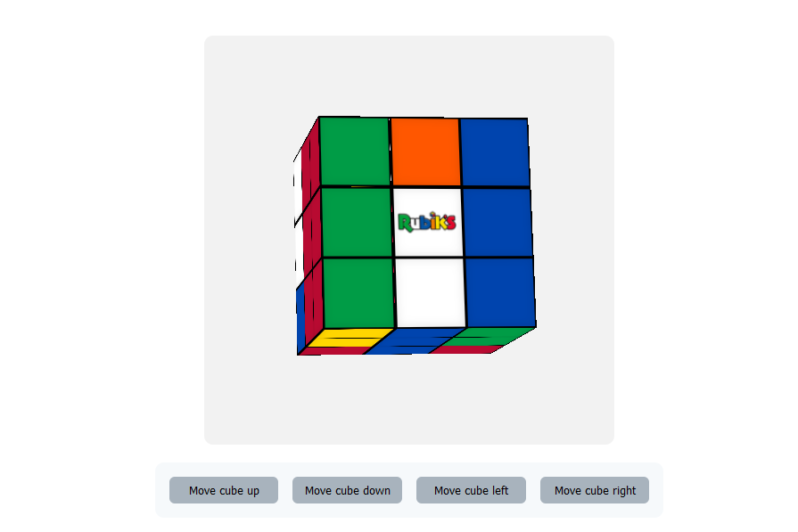

# Rubiks cube project

This is a hobby project of mine, where the goal ist to recreate a Rubiks cube with HTML, CSS and JavaScript. The cube is built using CSS 3D transforms and custom properties. I used quite a lot of JS to get the cube to move just like a real rubiks cube.

If you are on a touchscreen device, you can flick the cube sides with your finger to solve the cube. On desktop Computers there are buttons to do that.

The cube looks like this:

You can play with the cube and try to solve it with the deployed version of this repository code on gh pages [here](https://bernhard759.github.io/HTML_CSS_JS-Rubiks_cube/).